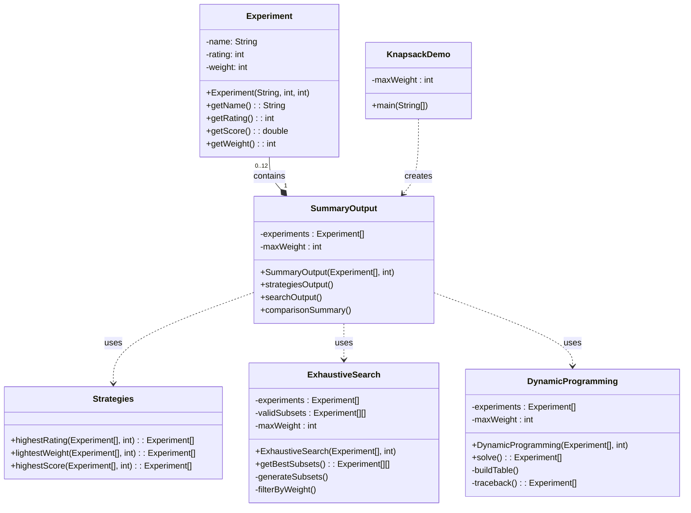

```mermaid
classDiagram
    class Experiment {
        -name: String
        -rating: int
        -weight: int
        +Experiment(String, int, int)
        +getName() : String
        +getRating() : int
        +getScore() : double
        +getWeight() : int
    }
    class SummaryOutput {
        -experiments : Experiment[]
        -maxWeight : int
        +SummaryOutput(Experiment[], int)
        +strategiesOutput()
        +searchOutput()
        +comparisonSummary()
    }
    class Strategies {
        +highestRating(Experiment[], int) : Experiment[]
        +lightestWeight(Experiment[], int) : Experiment[]
        +highestScore(Experiment[], int) : Experiment[]
    }
    class ExhaustiveSearch {
        -experiments : Experiment[]
        -validSubsets : Experiment[][]
        -maxWeight : int
        +ExhaustiveSearch(Experiment[], int)
        +getBestSubsets() : Experiment[][]
        -generateSubsets()
        -filterByWeight()
    }
    class DynamicProgramming {
        -experiments : Experiment[]
        -maxWeight : int
        +DynamicProgramming(Experiment[], int)
        +solve() : Experiment[]
        -buildTable()
        -traceback() : Experiment[]
    }
    class KnapsackDemo {
        -maxWeight : int
        +main(String[])
    }
    %% Relationships
    Experiment "0..12" --* "1" SummaryOutput : contains
    KnapsackDemo ..> SummaryOutput : creates
    SummaryOutput ..> Strategies : uses
    SummaryOutput ..> ExhaustiveSearch : uses
    SummaryOutput ..> DynamicProgramming : uses
```
